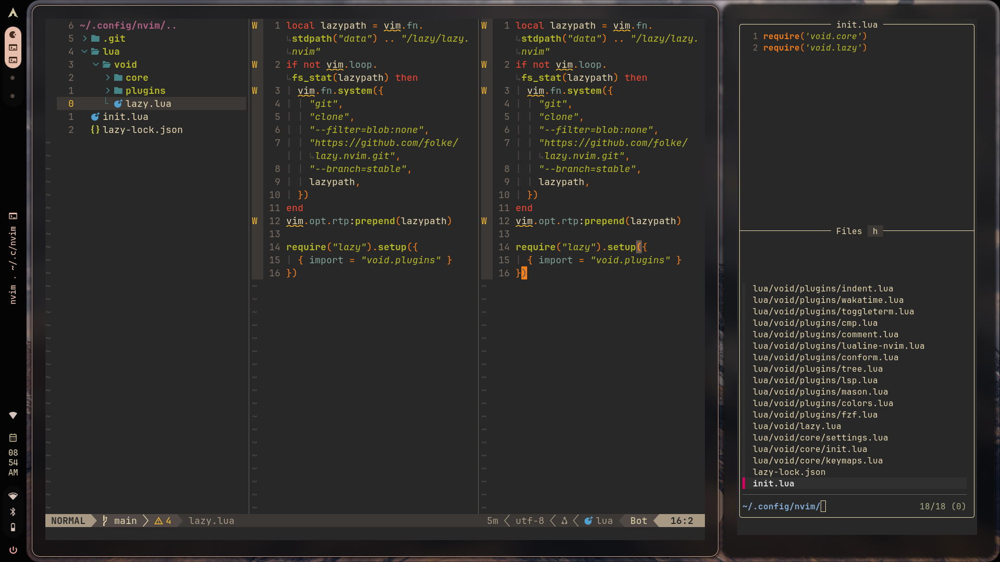

# Custom Neovim IDE

A lightweight, blazing-fast Neovim configuration built from scratch using `lazy.nvim`, designed for seamless web development, Python, and systems programming.



## Features

- **Package Management:** `lazy.nvim` for fast, asynchronous plugin loading.
- **File Explorer:** `nvim-tree` for visual project navigation.
- **Fuzzy Finder:** `fzf-lua` for lightning-fast file and text searching.
- **Intellisense:** Native Neovim LSP attached via `mason.nvim` and `nvim-lspconfig`.
- **Autocomplete:** `nvim-cmp` with VS Code-style snippet integration.
- **Auto-formatting:** `conform.nvim` (Prettier, Black, Stylua) triggering on save.
- **Integrated Terminal:** `toggleterm.nvim` for drop-down shell access.
- **UI & Aesthetics:** `gruvbox` colorscheme with a custom `lualine` status bar.

## Prerequisites

Before installing, ensure your system has the following:

- **Neovim** (v0.11.0 or higher)
- **Git** * **A Nerd Font** (e.g., *JetBrainsMono Nerd Font\*) for icons to render correctly.
- **Ripgrep** (Required for `fzf-lua` live grep functionality).

## Installation

1. **Backup your existing configuration (if any):**

   ```bash
   mv ~/.config/nvim ~/.config/nvim.bak
   mv ~/.local/share/nvim ~/.local/share/nvim.bak
   ```

2. **Clone the repository:**
   ```bash
   git clone git@github.com:balu401/nvim.git ~/.config/nvim
   ```
3. **Start Neovim:**
   ```bash
   nvim
   ```
   `lazy.nvim` will automatically bootstrap itself and install all plugins. Once finished, mason will automatically download the configured language servers.

## Keymap,Action

| Shortcut | Action |
| :--- | :--- |
| `<Space> + ee` | Toggle file explorer |
| `<Ctrl> + \` | Toggle integrated terminal |
| `<Ctrl> + Shift + p` | Fuzzy find files |
| `<Space> + /` | Live grep (search text across project) |
| `K` | Hover documentation (LSP) |
| `gd` | Go to definition (LSP) |
| `<Space> + rn` | Smart rename variable (LSP) |
| `<Space> + s` | Save file & auto-format |
